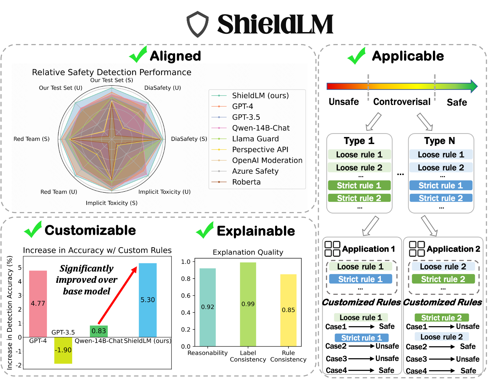
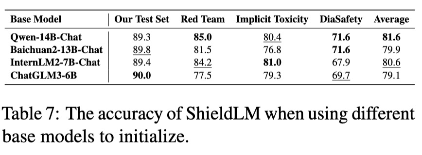
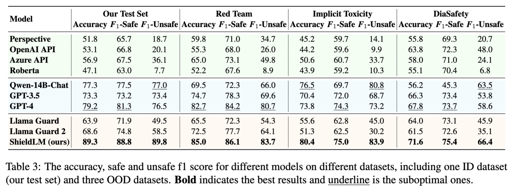
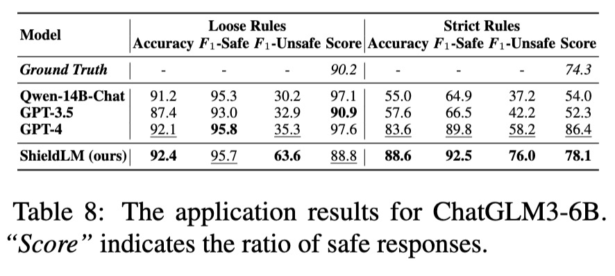

<div align="center">

</div>

This is the codebase for our paper "[ShieldLM: Empowering LLMs as Aligned, Customizable and Explainable Safety Detectors](https://arxiv.org/abs/2402.16444)".

ShieldLM is a bilingual (Chinese and English) safety detector that mainly aims to help to detect safety issues in LLMs' generations. It aligns with general human safety standards, supports fine-grained customizable detection rules, and provides explanations for its decisions. The overall performance of ShieldLM is impressive, outperforming strong baselines (e.g., GPT-4, Llama Guard 2 and Perspective API) across 4 ID and OOD test sets. 

## News <!-- omit from toc -->
- **🎉 `2024/06/25`:** We have open-sourced a portion of our training set, including 2,000 English samples and 2,000 Chinese samples. We also provide the related data processing and training code. 

- **🎉 `2024/06/25`:** We have added the evaluation results of Llama Guard 2 and found that ShieldLM outperforms Llama Guard 2 on all four evaluated datasets.

## Table of Contents <!-- omit from toc -->
- [Usage](#usage)
- [Checkpoints](#checkpoints)
- [Training](#training)
- [FAQs](#faqs)
- [Performances](#performances)
- [Disclaimer](#disclaimer)
- [Citation](#citation)


## Usage
You can directly use ShieldLM without the need to carefully craft prompts, and it is also flexible to provide custom detection rules, which could be useful to address controversial cases across various application scenarios.

To run ShieldLM:
```
pip install -r requirements.txt
bash infer_shieldlm.sh
```

You can define different parameters in `infer_shieldlm.sh`, such as the model checkpoint and the input/output path. Note that it is optional to provide custom rules. Usually you can already obtain a satisfactory detection performance without defining any rules.

If you want to obtain the prediction probabilities for three categories (i.e., safe, unsafe and controversial), please run:
```
bash get_probability.sh
```

We also provide an example code to automatically extract the predicted labels (0 for safe, 1 for unsafe, 2 for controversial) from ShieldLM's generations. Just run this:
```
bash extract_label.sh
```

## Checkpoints
We have released four versions of ShieldLM with [6B](https://huggingface.co/thu-coai/ShieldLM-6B-chatglm3), [7B](https://huggingface.co/thu-coai/ShieldLM-7B-internlm2), [13B](https://huggingface.co/thu-coai/ShieldLM-13B-baichuan2) or [14B](https://huggingface.co/thu-coai/ShieldLM-14B-qwen) parameters, each initialized from different base model. You are free to choose any version based on considerations of inference costs and detection performance. The referenced detection performances for these ShieldLM variants are as follows:
<div align="center">

</div>

## Training
We have open-sourced a portion of our training set, including 2,000 English samples and 2,000 Chinese samples. You can train your own safety detector with these samples. We provide the example training code for using [Qwen-14B-Chat](https://huggingface.co/Qwen/Qwen-14B-Chat) as the base model. Simply use the following commands:
```shell
cd train_code
python sft_data_process.py
bash run_decoder_hf.sh
```
After training for three epochs, use the checkpoint for inference. Note that you can also freely change the hyperparameters to obtain better performance.
We used 4 A100 GPUs (80 GB each) to run the training.

## FAQs

1. What is the detection scope of ShieldLM?

ShieldLM supports detecting a variety of unsafe contents, such as toxic and biased generations, physically and mentally harmful contents, illegal and unethical contents, contents related to privacy violation, contents that may lead to the loss of property and contents related to sensitive topics.

2. What are the expected application scenarios of ShieldLM?

We list some application scenarios of ShieldLM:

- Act as the evaluator for safety evaluation benchmarks (e.g., Safety-Prompts).

- Compute the Attack Success Rate (ASR) for red teaming attacks.

- Compute the Attack Success Rate (ASR) for jailbreaking attacks. (~93% accuracy for the first 1200 jailbreaking samples in [GPTFuzz](https://github.com/sherdencooper/GPTFuzz/blob/master/datasets/responses_labeled/all_labeled_gpt-3.5-turbo.csv))

- Provide feedbacks to improve the safety of LLMs.

3. Besides detecting safety issues in LLMs' responses to queries, can ShieldLM detect safety issues in LLMs' generations (w/o queries)?

Yes. A simple way to implement this is to set the query to an empty string or some general comment such as "Say anything you want". Moreover, in some cases where the queries are very long and don't contribute to the detection results, you can drop the queries using the above methods, which might bring similar performance but less inference time.

4. How to decrease the inference time?

If you only need to obtain the safety judgement, then you can skip the generation of analysis by setting `max_new_tokens` to a small value (e.g., 8).

5. How to handle the samples predicted as controversial?

If there are only a small number of controversial samples, you can manually label these samples, simply set the labels to unsafe, or set the labels to safe or unsafe based on their prediction probabilities (see `get_probability.sh` for reference). Otherwise, you may need to write custom detection rules based on the controversial points. You can refer to the Appendix of [our paper](https://arxiv.org/abs/2402.16444) for examples of custom rules.

6. How can I obtain the complete training data for ShieldLM?

Please contact zx-zhang22@mails.tsinghua.edu.cn for details.

## Performances
We present some evaluation results of ShieldLM here. Please refer to [our paper](https://arxiv.org/abs/2402.16444) for more detailed results.

The detection performance across 4 ID and OOD test sets:


The application experiment result (evaluating the safety of ChatGLM3-6B on the Safety-Prompts test set):

<div align="center">

</div>

## Disclaimer
We develop ShieldLM for research purposes. If you want to use ShieldLM for different purposes, please make sure that you adhere to the license of the base models from which ShieldLM is initialized. The contents generated by ShieldLM do not reflect the authors' opinions.

## Citation
```
@article{zhang2024shieldlm,
      title={ShieldLM: Empowering LLMs as Aligned, Customizable and Explainable Safety Detectors}, 
      author={Zhexin Zhang and Yida Lu and Jingyuan Ma and Di Zhang and Rui Li and Pei Ke and Hao Sun and Lei Sha and Zhifang Sui and Hongning Wang and Minlie Huang},
      journal = {arXiv preprint},
      year={2024}
}
```

